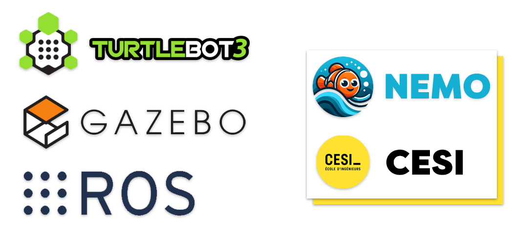
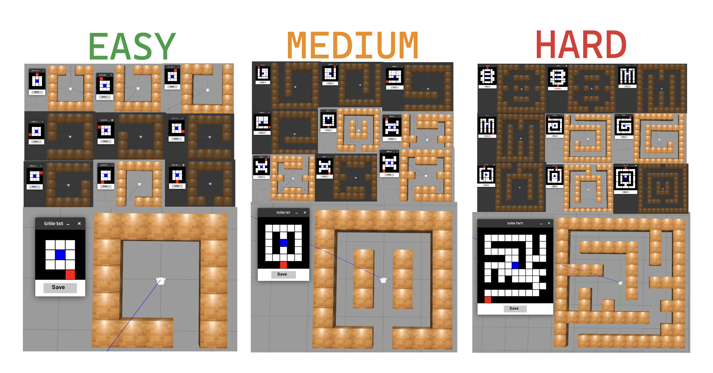

# Mobile Robot DRL Navigation

### A ROS2 framework for DRL autonomous navigation on mobile robots with LiDAR.
We were inspired by the following repository: [tomasvr/turtlebot3_drlnav](https://github.com/tomasvr/turtlebot3_drlnav)

<p align="center">
 
</p>

## Nemo Training
Nemo is a robot. Its objective is to learn how to find the exit of a labyrinth. To achieve this, we have constructed 30 mazes of varying difficulty levels to thoroughly train our model. The goal of this project is to train both a QNN (Quantum Neural Network) and an SNN (Spiking Neural Network) under the same conditions and analyze the results to find the optimal algorithm for this type of problem.

_Here is a summary of the generated mazes:_
<p align="left">
 
</p>


# **Installation**

# Nemo Installation Guide 

## System Requirements 

- Ubuntu 22.04
- ROS Humble
- Gazebo 11
- Pytorch 2.3
- Norse 1.1.0

## System Update 

First, ensure your system is up to date:


```bash
sudo apt-get update && sudo apt-get upgrade
```

## Install Essential Tools 

Install necessary build tools:


```bash
sudo apt-get install cmake build-essential make git
```

## Setup ROS 2 Sources 

Add the ROS 2 apt repository to your system. First, ensure that the Ubuntu Universe repository is enabled:


```bash
sudo apt install software-properties-common
sudo add-apt-repository universe
```

Add the ROS 2 GPG key with apt:


```bash
sudo apt update && sudo apt install curl -y
sudo curl -sSL https://raw.githubusercontent.com/ros/rosdistro/master/ros.key -o /usr/share/keyrings/ros-archive-keyring.gpg
```

Add the ROS 2 repository to your sources list:


```bash
echo "deb [arch=$(dpkg --print-architecture) signed-by=/usr/share/keyrings/ros-archive-keyring.gpg] http://packages.ros.org/ros2/ubuntu $(. /etc/os-release && echo $UBUNTU_CODENAME) main" | sudo tee /etc/apt/sources.list.d/ros2.list > /dev/null
```

## Install ROS 2 Packages 

Update your apt repository caches:


```bash
sudo apt update
```

Ensure your system is up to date:


```bash
sudo apt upgrade
```

Install ROS 2 Desktop (recommended) or ROS-Base:


```bash
sudo apt install ros-humble-desktop
```

Or for a bare-bones installation:


```bash
sudo apt install ros-humble-ros-base
```

Install development tools:


```bash
sudo apt install ros-dev-tools
```

## Environment Setup 
Source the setup script (replace `.bash` with your shell if you're not using bash):

```bash
source /opt/ros/humble/setup.bash
```

## Install Gazebo 

Install Gazebo:


```bash
curl -sSL http://get.gazebosim.org | sh
```

Install ROS Gazebo packages:


```bash
sudo apt install ros-humble-gazebo-ros-pkgs
```

## Install Additional Packages 

Install TurtleBot3 description and other dependencies:


```bash
sudo apt-get install ros-humble-turtlebot3-description
sudo apt install ros-humble-ros-core ros-humble-geometry2
```

Source the ROS setup script again:


```bash
source /opt/ros/humble/setup.bash
```

Install Python pip:


```bash
sudo apt install python3-pip
```

## Install PyTorch 

Install PyTorch with CUDA 11:


```bash
pip3 install torch torchvision torchaudio --index-url https://download.pytorch.org/whl/cu118
```

## Clone the Project 

Clone the project repository:


```bash
git clone https://github.com/ndium/nemoV2 . && cd nemoV2
```

Install specific numpy version and other dependencies:


```bash
pip uninstall numpy
pip install -r requirements.txt
```

## Install NVIDIA CUDA Toolkit 

Install NVIDIA CUDA toolkit:


```bash
sudo apt install nvidia-cuda-toolkit
```

Verify CUDA installation:


```bash
nvcc -V
nvidia-smi
```

## Install ROS Dep Tools 

Install ROS dependencies:


```bash
sudo apt install python3-rosdep2
rosdep update
rosdep install -i --from-path src --rosdistro humble -y
```

Install Colcon:


```bash
sudo apt update
sudo apt install python3-colcon-common-extensions
source install/setup.bash
```

## Update .bashrc 
Add the following lines to your `~/.bashrc` file, replacing `~/path/to/nemov2/repo` with the path where you cloned the repository:

```bash
source /opt/ros/humble/setup.bash

# ROS2 domain ID for network communication
export ROS_DOMAIN_ID=1

# Workspace directory
WORKSPACE_DIR=~/path/to/turtlebot3_drlnav
export DRLNAV_BASE_PATH=$WORKSPACE_DIR

# Source the workspace
source $WORKSPACE_DIR/install/setup.bash

# Allow Gazebo to find our TurtleBot3 models
export GAZEBO_MODEL_PATH=$GAZEBO_MODEL_PATH:$WORKSPACE_DIR/src/turtlebot3_simulations/turtlebot3_gazebo/models

# Select TurtleBot3 model (default: burger, waffle, waffle_pi)
export TURTLEBOT3_MODEL=burger

# Allow Gazebo to find the plugin for moving the obstacles
export GAZEBO_PLUGIN_PATH=$GAZEBO_PLUGIN_PATH:$WORKSPACE_DIR/src/turtlebot3_simulations/turtlebot3_gazebo/models/turtlebot3_drl_world/obstacle_plugin/lib
```

## Compile the Project 

Compile the project:


```bash
colcon build
```

If you encounter any CMake warnings:


```bash
source ~/.bashrc
colcon build
```

## Launch the Project 

Launch the simulation:


```bash
ros2 launch turtlebot3_gazebo turtlebot3_drl_stage4.launch.py
```

Run the environment:


```bash
ros2 run turtlebot3_drl environment
```

Train the agent:


```bash
ros2 run turtlebot3_drl train_agent dqn
```

Run Gazebo goals:


```bash
ros2 run turtlebot3_drl gazebo_goals
```

## Test project which is finished

example:

```bash
ros2 run turtlebot3_drl test_agent snn "snn_41_stage_4" 8000
``` 

# **Docker Installation (Recommended)**

In order to greatly simplify the installation process and get up and running quickly it is recommended to use Docker. Docker can be seen as a lightweight VM that allows you to run applications within an isolated container making it easy to install all of the dependencies.

First, [install docker](https://docs.docker.com/engine/install/ubuntu/)

Now, in order to use your GPU within the docker container to run the machine learning models, we need to complete a few extra simple steps.
You should already have the nvidia driver installed on your system.


## **Nvidia Container Toolkit**

The next thing we need to do is install the [nvidia container toolkit](https://docs.nvidia.com/datacenter/cloud-native/container-toolkit/overview.html) which is a piece of software that will allow us to use our GPU within the docker container. The installation steps are listed below.

First, setup the package repository and the GPG key:

```
curl -fsSL https://nvidia.github.io/libnvidia-container/gpgkey | sudo gpg --dearmor -o /usr/share/keyrings/nvidia-container-toolkit-keyring.gpg \
  && curl -s -L https://nvidia.github.io/libnvidia-container/stable/deb/nvidia-container-toolkit.list | \
    sed 's#deb https://#deb [signed-by=/usr/share/keyrings/nvidia-container-toolkit-keyring.gpg] https://#g' | \
    sudo tee /etc/apt/sources.list.d/nvidia-container-toolkit.list
```

Then install the container toolkit:
```
sudo apt-get update && sudo apt-get install -y nvidia-container-toolkit
```
-------ICI
Configure the Docker daemon to recognize the NVIDIA Container Runtime:
```
sudo nvidia-ctk runtime configure --runtime=docker
```

And lastly, restart the Docker daemon to complete the installation after setting the default runtime:
```
sudo systemctl restart docker
```

At this point, a working setup can be tested by running a base CUDA container:
```
sudo docker run --rm --runtime=nvidia --gpus all nvidia/cuda:11.7.1-base-ubuntu22.04 nvidia-smi
```
## **Build and run container**

Now build the container specified in the Dockerfile, which may take 10-20 minutes:

```
docker build -t nemov2 .
```

Lastly, we need to give our docker container permission to run GUIs:

```
xhost +local:docker
```

Launch docker compose:
```
docker-compose up
```
And that's it! we don't need to install any other dependencies thanks to docker.

While inside the container first build our application:
```
colcon build
```
And then source our packages:
```
source install/setup.bash
```


## **Utilities**
### Graph Generation

In order to compare results the repository includes a script that graphs the reward curves for different models. The script `reward_graph.py` can be found in the `util` directory.

To compare the reward curve for `ddpg_0` and `td3_0` every 100 episodes we type:
```
python3 util/reward_graph.py 100 examples/ddpg_0 examples/td3_0
```

Again, `examples/` should not be included in the path for your own models.

**Note: graph generation will only work correctly if training has not been stopped and continued. Otherwise you first need to merge the different _train_stage*.txt files into a single file**

### Cleaning model data

Training models can generate a lot of data, especially if you save the model often. In order to automatically clean models to save space, two cleaning scripts are included in the `util` folder.

**CAUTION: use the following scripts with caution as deleted data cannot be retrieved! Carefully examine the script settings and double-check the command line arguments you enter**

The following line will clean ddpg_0 removing all saved model states except:
* The model state for the 4 best-performing episodes
* The model state for the most recent episode
`python3 util/clean_single_model.py ddpg_0`

If you want to keep more or less data you can adjust the `TOP_EPISODES` parameters in the script itself.

To clean all of the models at once you can use the `purge_all_models.py` script. Carefully check the parameters at the top of the file before executing the script. To execute the script simply type:
```python3 util/purge_all_models.py```

The script will loop through all of your models and select the models to keep like explained above. In addition, models which scored too low or were trained for too few episodes will be removed completely (threshold specified in `purge_all_models.py`).

### Visualization

To enable a complete visualization of the neural network neuron activity and biases simply set `ENABLE_VISUAL` to `True` in `settings.py`. This requires the python3 packages `pyqtgraph` and `PyQt5` to be installed.
The visual should mainly be used during evaluation as it can slow down training significantly.
## Command Specification

**train_agent:**

```ros2 run turtlebot3_drl train_agent [algorithm=dqn/ddpg/td3/snn] [loadmodel=\path\to\model] [loadepisode=episode] ```

* `algorithm`: algorithm to run, one of either: `dqn`, `ddpg`, `td3`, `snn`
* `modelpath`: path to the model to be loaded to continue training
* `loadepisode`: is the episode to load from `modelpath`

**test_agent:**

```ros2 run turtlebot3_drl test_agent [algorithm=dqn/ddpg/td3/snn] [loadmodel=\path\to\model] [loadepisode=episode] ```

* `algorithm`: algorithm to run, one of either: `dqn`, `ddpg`, `td3`, `snn`
* `modelpath`: path to model to be loaded for testing
* `loadepisode`: is the episode to load from `modelpath`

# Physical Robot

The are three main requirements for a robot to be compatible with this project:
* The robot needs to provide LiDAR scan information
* The robot needs to provide any kind of odometry information (e.g. tachometers, SLAM, AMCL or GPS)
* The robot needs to be able to work with linear and angular velocity messages

To run one of your models (trained in simulation) on a physical robot follow these steps:
* In settings.py, adjust the REAL ROBOT ENVIRONMENT SETTINGS
  * **REAL_TOPIC**: Set the right ROS topics for your laser scan, odometry and velocity inputs/outputs
  * **REAL_N_SCAN_SAMPLES**: Configure the number of Lidar samples your robot will provide
  * **REAL_LIDAR_CORRECTION**: Depending on the dimensions of your robot the LiDAR values might need to be corrected to avoid the agent from detecting a 'collision' when the robot has not yet actually collided with any obstacle. This value is simply subtracted from the real LiDAR readings and finding the right value requires some trial and error.
  * Set the remaining options such as the arena dimensions, max velocities, max LiDAR distance, and goal and collision thresholds.

Next, when using a physical robot we do not need to run the gazebo simulation node or the gazebo_goals node. We will however still need to run an environment node and an agent node.

At this point, turn on the robot and initialize all of its components. Ensure that:
* LiDAR scan ROS messages are being sent over the configured TOPIC_SCAN topic
* Odometry ROS messages are being sent over the TOPIC_ODOM topic
* The robot is listening for velocity ROS messages on the TOPIC_VELO topic.

**Note:** If you are running nodes on multiple machines (e.g. one laptop and one robot) ensure that all machines have the same value set for `ROS_DOMAIN_ID` in `~/.bashrc`:

`export ROS_DOMAIN_ID=[X]` (X can be any number as long as it is the same for each machine).

Also ensure that all machines are connected to the same Local Area Network (LAN).

Now, open a terminal on your laptop (or robot) and run the environment node for a real robot:
```
ros2 run turtlebot3_drl real_environment
```

Then, open another terminal and run the agent node for a real robot (substitute your model name and desired episode to load):
```
ros2 run turtlebot3_drl real_agent [ALGORITHM_NAME] [MODEL_NAME] [MODEL_EPISODE]
```
For example:
```
ros2 run turtlebot3_drl real_agent ddpg ddpg_1_stage4 1000
```

If everything loads correctly, you can now use the included script to generate a goal at location (x=1, y=1):
```
./spawn_goal 1 1
```

**And that's it!** You should now see the robot start moving toward the goal while avoiding obstacles.

**Note:** You can use RViz2 in order to visualize the LiDAR scans for debugging and fine-tuning the REAL_LIDAR_CORRECTION value: simply add a `laser_scan` display type and set its topic to `TOPIC_SCAN`.

## How to generate a maze ?
For a maze of size : 7x7
```bash
python3 grid.py 7
```

## How to change the testing lab ?
- Get a maze in folder mazes_generation/
- Get content of an xml file and remplace content of : /src/turtlebot3_simulations/turtlebot3_gazebo/worlds/turtlebot3_drl_stage4/burger.model
- Copy the cordinates (maze exit) in comment, exemple : 1.0, 0.5
- Replace line 171 (stage 4) with the coordinates : goal_pose_list = [[1.0, 0.5]]
- run ```colcon build```
- launch ```ros2 launch turtlebot3_gazebo turtlebot3_drl_stage4.launch.py```

# **Troubleshooting**

## **bash: /opt/ros/humble/setup.bash: No such file or directory**

Depending on your installation method of ROS, it might be required to add the following line to your `~/bashrc` file:
```
source ~/ros2_humble/ros2-linux/setup.bash
```
Also, make sure that you source the correct setup files in your `~/.bashrc` as described in the installation section of this guide.

## **Package 'turtlebot3_gazebo' not found: "package 'turtlebot3_gazebo' not found, searching: ['/opt/ros/humble']"**

Make sure to run `source install/setup.bash` from the root of the repository in every terminal every time after you build the project using `colcon_build`. Otherwise, the nodes will not run the updated version of your code but the old version from the last time you built and sourced.
